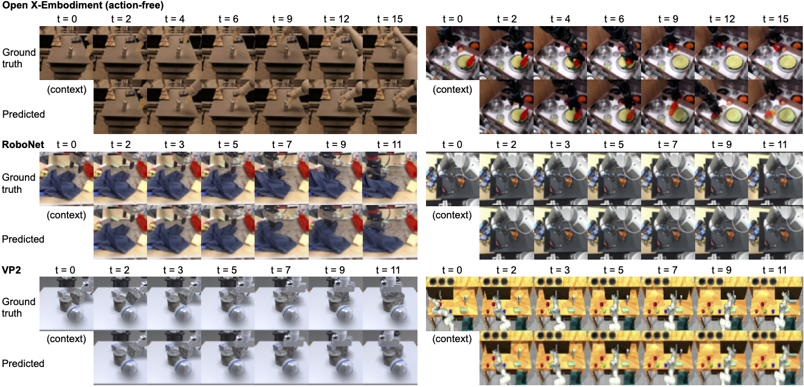

# 🌏 iVideoGPT: Interactive VideoGPTs are Scalable World Models (NeurIPS 2024)

[[Project Page]](https://thuml.github.io/iVideoGPT/) [[Paper]](https://arxiv.org/abs/2405.15223) [[Models]](https://huggingface.co/collections/thuml/ivideogpt-674c59cae32231024d82d6c5) [[Poster]](https://manchery.github.io/assets/pub/nips2024_ivideogpt/poster.pdf) [[Slides]](https://manchery.github.io/assets/pub/nips2024_ivideogpt/slides.pdf) [[Blog (In Chinese)]](https://mp.weixin.qq.com/s/D94aamdqtO9WLekr4BSCUw)

This repo provides official code and checkpoints for iVideoGPT, a generic and efficient world model architecture that has been pre-trained on millions of human and robotic manipulation trajectories. 


## 🔥 News

- 🚩 **2024.11.01**: NeurIPS 2024 camera-ready version is released on [arXiv](https://arxiv.org/abs/2405.15223v3).
- 🚩 **2024.09.26**: iVideoGPT has been accepted by NeurIPS 2024, congrats!
- 🚩 **2024.08.31**: Training code is released (Work in progress 🚧 and please stay tuned!)
- 🚩 **2024.05.31**: Project website with video samples is released.
- 🚩 **2024.05.30**: Model pre-trained on Open X-Embodiment and inference code are released.
- 🚩 **2024.05.27**: Our paper is released on [arXiv](https://arxiv.org/abs/2405.15223v1).

## 🛠️ Installation

```bash
conda create -n ivideogpt python==3.9
conda activate ivideogpt
pip install -r requirements.txt
```

To evaluate the FVD metric, download the [pretrained I3D model](https://www.dropbox.com/s/ge9e5ujwgetktms/i3d_torchscript.pt?dl=1) into `pretrained_models/i3d/i3d_torchscript.pt`.

## 🤗 Models

At the moment we provide the following pre-trained models:

| Model | Resolution | Action-conditioned | Goal-conditioned | Tokenizer Size | Transformer Size |
| ---- | ---- | ---- | ---- | ---- | ---- |
| [ivideogpt-oxe-64-act-free](https://huggingface.co/thuml/ivideogpt-oxe-64-act-free) | 64x64 | No | No | 114M   |  138M    |
| [ivideogpt-oxe-64-act-free-medium](https://huggingface.co/thuml/ivideogpt-oxe-64-act-free-medium) | 64x64 | No | No |  114M   |  436M    |
| [ivideogpt-oxe-64-goal-cond](https://huggingface.co/thuml/ivideogpt-oxe-64-goal-cond) | 64x64 | No | Yes | 114M   |  138M    |
| [ivideogpt-oxe-256-act-free](https://huggingface.co/thuml/ivideogpt-oxe-256-act-free) | 256x256 | No | No | 310M   |  138M    |

If no network connection to Hugging Face, you can manually download from [Tsinghua Cloud](https://cloud.tsinghua.edu.cn/d/ef7d94c798504587a95e/).

**Notes**:

- Due to the heterogeneity of action spaces, we currently do not have an action-conditioned prediction model on OXE.
- Pre-trained models at 256x256 resolution may not perform best due to insufficient training, but can serve as a good starting point for downstream fine-tuning.

<details>
  <summary><b>More models on downstream tasks</b></summary>
  <br>
  
| Model | Resolution | Action-conditioned | Goal-conditioned | Tokenizer Size | Transformer Size |
| ---- | ---- | ---- | ---- | ---- | ---- |
| [ivideogpt-bair-64-act-free](https://huggingface.co/thuml/ivideogpt-bair-64-act-free) | 64x64 | No | No |  114M   |  138M    |
| [ivideogpt-bair-64-act-cond](https://huggingface.co/thuml/ivideogpt-bair-64-act-cond) | 64x64 | Yes | No | 114M   |  138M    |
| [ivideogpt-robonet-64-act-cond](https://huggingface.co/thuml/ivideogpt-robonet-64-act-cond) | 64x64 | Yes | No |  114M   |  138M    |

- We are sorry that the checkpoints for RoboNet at 256x256 resolution were deleted by mistake during a disk cleanup, we will retrain and release them as soon as possible! 
</details>

## 📦 Data Preparation

**Open X-Embodiment**: Download datasets from [Open X-Embodiment](https://github.com/google-deepmind/open_x_embodiment) and extract single episodes as `.npz` files:

```bash
python datasets/oxe_data_converter.py --dataset_name {dataset name, e.g. bridge} --input_path {path to downloaded OXE} --output_path {path to stored npz}
```

To replicate our pre-training on OXE, you need to extract all datasets listed under `OXE_SELECT` in `ivideogpt/data/dataset_mixes.py`.

See instructions at [`datasets`](/datasets) on preprocessing more datasets.

## 🚀 Inference Examples

For action-free video prediction on Open X-Embodiment, run:

```bash
python inference/predict.py --pretrained_model_name_or_path "thuml/ivideogpt-oxe-64-act-free" --input_path inference/samples/fractal_sample.npz --dataset_name fractal20220817_data
```

See more examples at [`inference`](/inference).

## 🌟 Pre-training

To pre-train iVideoGPT, adjust the arguments in the command below as needed and run:

```bash
bash ./scripts/pretrain/ivideogpt-oxe-64-act-free.sh
```

See more scripts for [pre-trained models](#-models) at [`scripts/pretrain`](/scripts/pretrain).

## 🎇 Fine-tuning Video Prediction

### Finetuning Tokenizer

After preparing the [BAIR](/datasets#bair-robot-pushing) dataset, run the following:

```bash
accelerate launch train_tokenizer.py \
    --exp_name bair_tokenizer_ft --output_dir log_vqgan --seed 0 --mixed_precision bf16 \
    --model_type ctx_vqgan \
    --train_batch_size 16 --gradient_accumulation_steps 1 --disc_start 1000005 \
    --oxe_data_mixes_type bair --resolution 64 --dataloader_num_workers 16 \
    --rand_select --video_stepsize 1 --segment_horizon 16 --segment_length 8 --context_length 1 \
    --pretrained_model_name_or_path pretrained_models/ivideogpt-oxe-64-act-free/tokenizer
```

### Finetuning Transformer

For action-conditioned video prediction, run the following:

```bash
accelerate launch train_gpt.py \
    --exp_name bair_llama_ft --output_dir log_trm --seed 0 --mixed_precision bf16 \
    --vqgan_type ctx_vqgan \
    --pretrained_model_name_or_path {log directory of finetuned tokenizer}/unwrapped_model \
    --config_name configs/llama/config.json --load_internal_llm --action_conditioned --action_dim 4 \
    --pretrained_transformer_path pretrained_models/ivideogpt-oxe-64-act-free/transformer \
    --per_device_train_batch_size 16 --gradient_accumulation_steps 1 \
    --learning_rate 1e-4 --lr_scheduler_type cosine \
    --oxe_data_mixes_type bair --resolution 64 --dataloader_num_workers 16 \
    --video_stepsize 1 --segment_length 16 --context_length 1 \
    --use_eval_dataset --use_fvd --use_frame_metrics \
    --weight_decay 0.01 --llama_attn_drop 0.1 --embed_no_wd
```

For action-free video prediction, remove `--load_internal_llm --action_conditioned`.

### Evaluation

To evaluate the checkpoints only, run:

```bash
bash ./scripts/evaluation/bair-64-act-cond.sh
```

See more scripts for [released checkpoints](#-models) at [`scripts/evaluation`](/scripts/evaluation).

## 🤖 Visual Model-based RL

### Preparation

Install the Metaworld version we used:

```bash
pip install git+https://github.com/Farama-Foundation/Metaworld.git@83ac03ca3207c0060112bfc101393ca794ebf1bd
```

Modify paths in `mbrl/cfgs/mbpo_config.yaml` to your own paths (currently only support absolute paths).

### MBRL with iVideoGPT

```bash
python mbrl/train_metaworld_mbpo.py task=plate_slide num_train_frames=100002 demo=true
```

## 🎥 Showcases



## 📜 Citation

If you find this project useful, please cite our paper as:

```
@inproceedings{wu2024ivideogpt,
    title={iVideoGPT: Interactive VideoGPTs are Scalable World Models}, 
    author={Jialong Wu and Shaofeng Yin and Ningya Feng and Xu He and Dong Li and Jianye Hao and Mingsheng Long},
    booktitle={Advances in Neural Information Processing Systems},
    year={2024},
}
```

## 🤝 Contact

If you have any question, please contact wujialong0229@gmail.com.

## 💡 Acknowledgement

Our codebase is based on [huggingface/diffusers](https://github.com/huggingface/diffusers) and [facebookresearch/drqv2](https://github.com/facebookresearch/drqv2).
